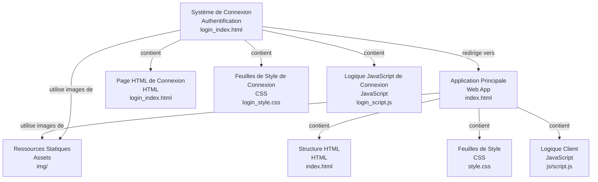

# Codebase Research Report

## Query
fais une architecture glogable du projte 

## Answer
# Architecture Globale du Projet

Le projet "Gym-by Tobi" est une application web simple, structurée autour d'une page principale pour la présentation du gymnase et d'un système de connexion séparé. L'architecture est principalement front-end, utilisant HTML, CSS et JavaScript pour la logique côté client et la présentation.

## Composants Principaux

Le projet est divisé en trois composants principaux :

1.  **Application Principale** : Le cœur du site web, présentant les informations sur le gymnase.
2.  **Système de Connexion** : Une section dédiée à l'authentification des utilisateurs.
3.  **Ressources Statiques (Assets)** : Contient toutes les images utilisées par l'application.

### Application Principale

Ce composant représente la page d'accueil et les fonctionnalités principales du site web du gymnase.

*   **Objectif** : Afficher les informations sur le gymnase, les services, les témoignages et les appels à l'action.
*   **Parties Internes** :
    *   **Structure HTML** : Définie dans [index.html](index.html), elle contient le contenu textuel et la mise en page de la page principale.
    *   **Feuilles de Style** : Les styles visuels de l'application sont gérés par [style.css](style.css), qui définit l'apparence des éléments HTML.
    *   **Logique Client** : Le fichier [js/script.js](js/script.js) contient le code JavaScript pour les interactions utilisateur, les animations ou toute logique dynamique sur la page principale.
*   **Relations Externes** : Utilise les images stockées dans le [répertoire img/](img/) pour les bannières, les témoignages et d'autres éléments visuels.

### Système de Connexion

Ce composant gère l'interface et la logique pour la connexion des utilisateurs.

*   **Objectif** : Fournir une interface pour que les utilisateurs puissent se connecter à l'application.
*   **Parties Internes** :
    *   **Page HTML de Connexion** : La structure de la page de connexion est définie dans [login_index.html](login_index.html).
    *   **Feuilles de Style de Connexion** : Les styles spécifiques à la page de connexion sont définis dans [login_style.css](login_style.css).
    *   **Logique JavaScript de Connexion** : Le fichier [login_script.js](login_script.js) contient la logique pour la validation des formulaires de connexion et la gestion de l'authentification (bien que l'implémentation réelle de l'authentification côté serveur ne soit pas visible dans cette structure front-end).
*   **Relations Externes** : Après une connexion réussie, il est probable que ce système redirige l'utilisateur vers l'[application principale](index.html).

### Ressources Statiques (Assets)

Ce répertoire centralise toutes les ressources visuelles utilisées par l'application.

*   **Objectif** : Stocker et organiser les images utilisées à travers le site web.
*   **Parties Internes** : Contient divers fichiers image tels que [banner-img.png](img/banner-img.png), [blur-1.png](img/blur-1.png), [client1.jpg](img/client1.jpg), [discount.png](img/discount.png), [explore.jpg](img/explore.jpg), [testimonial.png](img/testimonial.png), [trainer1.jpg](img/trainer1.jpg), [trainer2.jpg](img/trainer2.jpg), [trainer3.jpg](img/trainer3.jpg), et [why-us.png](img/why-us.png).
*   **Relations Externes** : Les images de ce répertoire sont référencées par les fichiers HTML ([index.html](index.html), [login_index.html](login_index.html)) et les feuilles de style ([style.css](style.css), [login_style.css](login_style.css)) pour l'affichage visuel.

### Documentation

*   **Objectif** : Fournir des informations générales sur le projet.
*   **Parties Internes** : Le fichier [README.md](README.md) contient la documentation du projet.

---
*Generated by [CodeViz.ai](https://codeviz.ai) on 10/04/2025 09:43:27*
